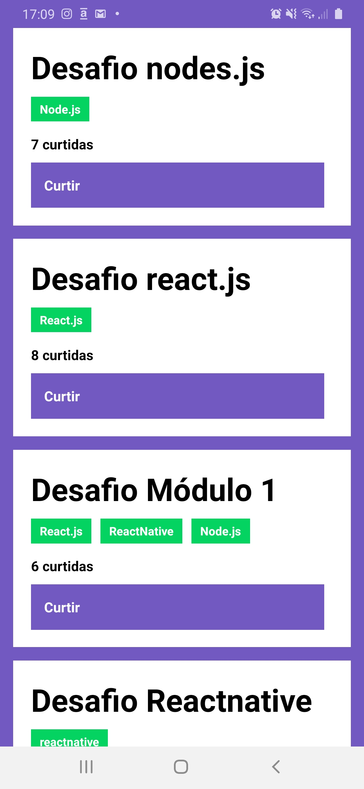

### :rocket: Desafio 04: Conceitos do React Native Bootcamp GoStack 11.0
Neste desafio foi solicitada a criação de uma aplicação para aplicar os conceitos iniciais aprendidos sobre React Native


### Resultado visual

<br>


### Tecnologias utilizadas

- [ReactNative](https://reactnative.dev/)
- [Jest](https://www.npmjs.com/package/jest)
- [Supertest](https://www.npmjs.com/package/supertest)


### Executando aplicação Mobile

```js
yarn
yarn android ou yarn ios
yarn start
```

**Para executar os testes:**

```js
yarn test
```

### Backend da aplicação

- [Desafio 2](https://github.com/adrianoluisalmeida/desafio-02-gostack11) - Para rodar a aplicação, basta entrar na tela e executar os seguintes comandos:

```js
yarn
yarn dev
```

### :muscle: Projeto

Aplicação de introdução ao reactnative do bootcamp gostack 11.0 para dar likes em repositórios repositórios em um portofólio.


### :memo: Licença 

Esse projeto está sob a licença MIT. Veja o arquivo [LICENSE](LICENSE.md) para mais detalhes.

---

<p align="center">Feito  por <strong>Adriano Almeida</p>
